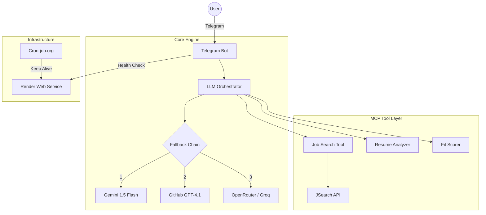

# Telegram Job Scout Agent

An autonomous agentic workflow for job discovery, resume analysis, and real-time fit scoring. This system is designed for high availability, featuring a multi-provider LLM fallback chain and a resilient API key rotation strategy.

---

## Architecture



| Layer | Technology | Purpose |
|---|---|---|
| **Interface** | Telegram Bot | User interaction and file handling |
| **Logic** | Python / OpenClaw | Agent orchestration and tool execution |
| **Search** | JSearch API | Live job data from LinkedIn/Indeed/Glassdoor |
| **Brain** | Multi-LLM | Structured analysis and scoring |
| **Hosting** | Render | 24/7 deployment with health-check monitoring |

---

## Key Features

- **Resilient Fallback**: Automatically rotates between 6+ LLM providers (Gemini, GitHub, Groq, SambaNova, OpenRouter) if a rate limit is hit.
- **API Key Rotation**: Supports multiple keys per provider for uninterrupted service.
- **Zero-Cost Deployment**: Optimized for 100% free hosting using Render's free tier and cron-job heartbeats.
- **Resume Fit Scoring**: Instant 0-100 score based on technical overlap and experience.

---

## Setup Instructions

### 1. Environment Configuration
Create a `.env` file with the following variables:

```bash
# Bot Configuration
TELEGRAM_BOT_TOKEN=your_bot_token
PORT=8080

# Job Search
JSEARCH_API_KEY=primary_key
JSEARCH_API_KEY1=backup_key

# LLM Providers
GITHUB_TOKEN=primary_token
GITHUB_TOKEN1=backup_token
OPENROUTER_API_KEY=your_key
GEMINI_API_KEY=your_key
SAMBANOVA_API_KEY=your_key
```

### 2. Local Setup
```bash
git clone https://github.com/Kunal04041/OpenClaw-Integrated-MCP-Server-for-Job-Discovery-Resume-Fit-Scoring.git
pip install -r requirements.txt
python telegram_bot.py
```

### 3. Deployment (Render)
- **Service Type**: Web Service
- **Build Command**: `pip install -r requirements.txt`
- **Start Command**: `python telegram_bot.py`
- **Health Check**: Use [cron-job.org](https://cron-job.org/) to ping your Render URL every 10 minutes to prevent sleeping.

---

## Project Structure
```text
.
├── telegram_bot.py     # Main entry point and bot logic
├── Procfile             # Deployment manifest
├── requirements.txt     # Dependencies
├── mcp-server/          # Multi-Model Logic
│   ├── llm_service.py     # Fallback and rotation logic
│   ├── job_search.py      # JSearch API integration
│   ├── resume_analyzer.py # LLM-based analysis
│   └── fit_score.py       # Fit calculation
└── README.md
```
